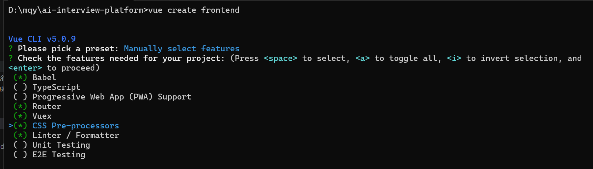
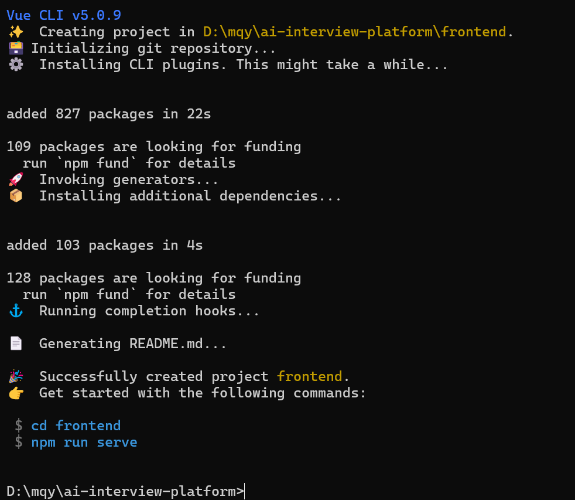

# AI模拟面试与能力提升软件 - 项目完整搭建指南

## 一、项目概述

这是一个基于 **Vue.js + Flask** 的前后端分离项目，实现AI模拟面试核心功能。

## 二、环境准备

### 2.1 安装必要工具

#### 前端
前置说明：开发环境与技术栈
| 模块   | 技术选型                                                     |
| ------ | ------------------------------------------------------------ |
| 前端   | 编辑器：VS Code；<br>框架：Vue 3、Vue Router、Vuex；<br>网络请求：Axios |  
##### 1.安装VS Code（或者PyCharm）

1.访问官网：https://code.visualstudio.com/
2.点击“Download”按钮，根据本机操作系统选择对应版本
3.下载完成后，运行安装程序（注：建议勾选“添加到PATH”）

##### 2.安装Node.js和npm
1.访问官网：https://nodejs.org/
2.下载LTS（长期支持）版本
3.安装过程：双击安装文件，勾选“Add to PATH”
4.验证安装：
- 打开终端
 - 命令提示符：win+R 然后输入cmd
 - 菜单搜索PowerShell
- 输入`node -v`和`npm -v`，如果显示版本号则安装成功。


**3.安装Vue CLI**打开任意终端（VSCode终端、系统自带cmd、PowerShell、Terminal），输入以下命令：
```
npm install -g @vue/cli
```

###### 注：上面任何一个工具，已经下载了可以跳过，另外，Vue CLI之前安装了，现在更新一下：`npm update -g @vue/cli`


#### 后端

前置说明：开发环境与技术栈
| 模块   | 技术选型                                                     |
| ------ | ------------------------------------------------------------ |
| 后端   | 编辑器：PyCharm；<br>语言：Python 3.9+；<br>框架：Flask；<br>ORM：SQLAlchemy；<br>跨域：Flask-CORS |
| 数据库 | MySQL 9.2；<br>可视化工具：Navicat                           |


## 三、项目初始化

### 3.1 创建项目根目录
```bash
# 创建主项目文件夹
mkdir ai-interview-platform
cd ai-interview-platform

# 初始化git仓库
git init
echo "# AI模拟面试平台" > README.md
```

### 3.2 创建前端项目 (Vue)
```bash
# 在根目录下创建前端项目
vue create frontend

# 选择手动配置 (Manually select features)
# 勾选: Babel, Router, Vuex, CSS Pre-processors, Linter
# 选择 Vue 3
# 使用 history mode for router: Yes
# 选择 Sass/SCSS
# 选择 ESLint + Prettier
# 选择 Lint on save 
# 选择 package.json 管理配置
# 选择 N
```


### 3.3 创建后端项目 (Flask)
```bash
# 在根目录下创建后端文件夹
mkdir backend
cd backend
```
采用python 3.12.3
```bash
# 查看版本号，不是3.12.3就去下载
python -V
# 创环境
python -m venv venv
venv\Scripts\activate
```

## 四、完整的项目结构

```
ai-interview-platform/
├── frontend/                    # Vue前端项目
│   ├── public/
│   │   ├── index.html
│   │   └── favicon.ico
│   ├── src/
│   │   ├── api/                 # API接口层
│   │   │   ├── index.js         # axios配置
│   │   │   ├── auth.js          # 认证相关接口
│   │   │   ├── interview.js     # 面试相关接口
│   │   │   ├── report.js        # 报告相关接口
│   │   │   ├── learning.js      # 学习中心接口
│   │   │   └── user.js          # 用户相关接口
│   │   ├── assets/              # 静态资源
│   │   │   ├── images/
│   │   │   ├── styles/
│   │   │   │   ├── variables.scss
│   │   │   │   └── global.scss
│   │   │   └── icons/
│   │   ├── components/          # 公共组件
│   │   │   ├── common/
│   │   │   │   ├── NavBar.vue
│   │   │   │   ├── BottomNav.vue
│   │   │   │   ├── LoadingSpinner.vue
│   │   │   │   └── EmptyState.vue
│   │   │   ├── charts/
│   │   │   │   ├── RadarChart.vue    # 雷达图组件
│   │   │   │   └── LineChart.vue     # 折线图组件
│   │   │   └── interview/
│   │   │       ├── MessageBubble.vue
│   │   │       ├── VoiceInput.vue
│   │   │       └── Timer.vue
│   │   ├── views/               # 页面视图
│   │   │   ├── auth/
│   │   │   │   ├── Login.vue
│   │   │   │   └── Register.vue
│   │   │   ├── home/
│   │   │   │   └── Dashboard.vue      # 首页/仪表盘
│   │   │   ├── interview/
│   │   │   │   ├── JobSelection.vue   # 岗位选择
│   │   │   │   ├── InterviewSession.vue # 模拟面试主界面
│   │   │   │   └── InterviewReport.vue  # 面试报告
│   │   │   ├── learning/
│   │   │   │   └── LearningCenter.vue   # 学习中心
│   │   │   ├── history/
│   │   │   │   └── HistoryRecords.vue   # 历史记录
│   │   │   └── profile/
│   │   │       └── PersonalCenter.vue   # 个人中心
│   │   ├── router/
│   │   │   └── index.js          # 路由配置
│   │   ├── store/
│   │   │   ├── index.js          # Vuex主文件
│   │   │   ├── modules/
│   │   │   │   ├── user.js       # 用户模块
│   │   │   │   ├── interview.js  # 面试模块
│   │   │   │   └── learning.js   # 学习模块
│   │   │   └── getters.js
│   │   ├── utils/
│   │   │   ├── request.js        # 请求封装
│   │   │   ├── auth.js           # 认证工具
│   │   │   ├── voice.js          # 语音工具
│   │   │   └── constants.js      # 常量定义
│   │   ├── App.vue
│   │   └── main.js
│   ├── .env.development          # 开发环境变量
│   ├── .env.production           # 生产环境变量
│   ├── vue.config.js             # Vue配置
│   ├── package.json
│   └── README.md
│
├── backend/                      # Flask后端项目
│   ├── app/
│   │   ├── __init__.py           # 应用工厂
│   │   ├── extensions.py         # 扩展初始化
│   │   ├── config.py             # 配置文件
│   │   ├── models/               # 数据模型
│   │   │   ├── __init__.py
│   │   │   ├── user.py           # 用户模型
│   │   │   ├── interview.py      # 面试模型
│   │   │   ├── question.py       # 题目模型
│   │   │   ├── report.py         # 报告模型
│   │   │   └── learning.py       # 学习资源模型
│   │   ├── api/                  # API路由
│   │   │   ├── __init__.py
│   │   │   ├── v1/
│   │   │   │   ├── __init__.py
│   │   │   │   ├── auth.py       # 认证接口
│   │   │   │   ├── users.py      # 用户接口
│   │   │   │   ├── interviews.py # 面试接口
│   │   │   │   ├── questions.py  # 题目接口
│   │   │   │   ├── reports.py    # 报告接口
│   │   │   │   └── learning.py   # 学习接口
│   │   │   └── websocket/        # WebSocket
│   │   │       └── interview.py  # 实时面试对话
│   │   ├── services/             # 业务逻辑
│   │   │   ├── __init__.py
│   │   │   ├── ai_service.py     # AI对话服务
│   │   │   ├── scoring.py        # 评分服务
│   │   │   ├── report_gen.py     # 报告生成
│   │   │   ├── voice_service.py  # 语音识别服务
│   │   │   └── recommendation.py # 推荐服务
│   │   ├── utils/                # 工具函数
│   │   │   ├── __init__.py
│   │   │   ├── decorators.py     # 装饰器
│   │   │   ├── helpers.py        # 辅助函数
│   │   │   └── validators.py     # 验证器
│   │   └── static/               # 静态文件
│   ├── tests/                    # 测试
│   │   ├── __init__.py
│   │   ├── test_api/
│   │   ├── test_models/
│   │   └── test_services/
│   ├── migrations/               # 数据库迁移
│   ├── logs/                      # 日志文件
│   ├── uploads/                   # 上传文件
│   ├── requirements.txt           # 依赖包
│   ├── requirements-dev.txt       # 开发依赖
│   ├── run.py                     # 启动文件
│   ├── wsgi.py                     # WSGI入口
│   └── .env                        # 环境变量
│
├── docs/                          # 项目文档
│   ├── api_docs.md                # API文档
│   ├── database_design.md         # 数据库设计
│   ├── deployment.md              # 部署文档
│   └── team_workflow.md           # 团队协作流程
│
├── scripts/                       # 脚本工具
│   ├── init_db.py                 # 初始化数据库
│   ├── seed_data.py               # 填充测试数据
│   └── deploy.sh                  # 部署脚本
│
├── docker/                        # Docker配置
│   ├── Dockerfile.frontend
│   ├── Dockerfile.backend
│   └── docker-compose.yml
│
├── .gitignore
├── .gitlab-ci.yml                 # CI/CD配置
├── .eslintrc.js                    # ESLint配置
├── .prettierrc                     # Prettier配置
├── package.json                    # 项目根依赖（可选）
└── README.md
```

